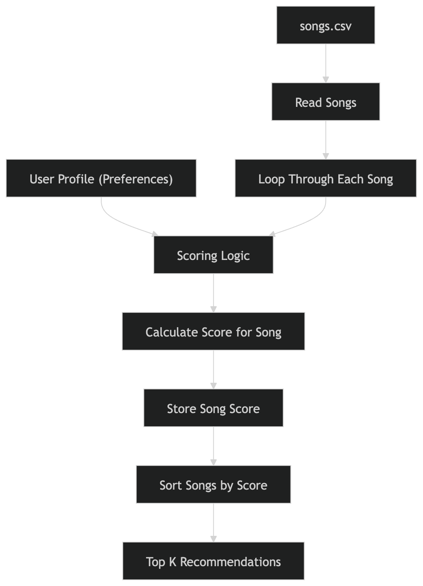
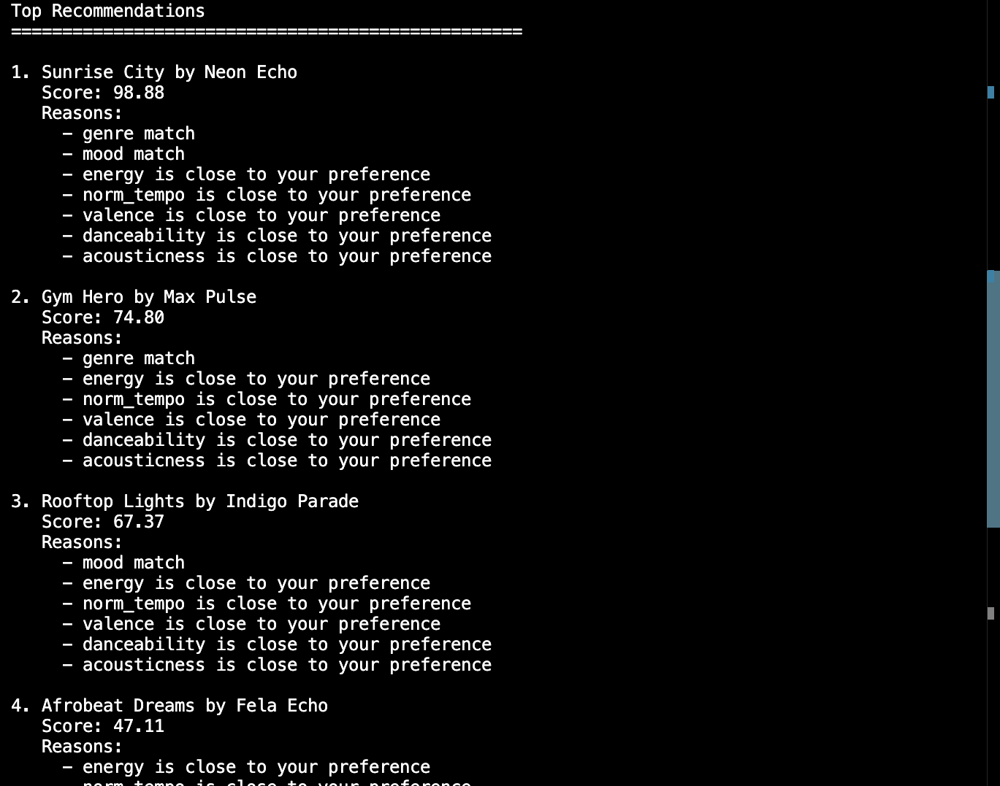
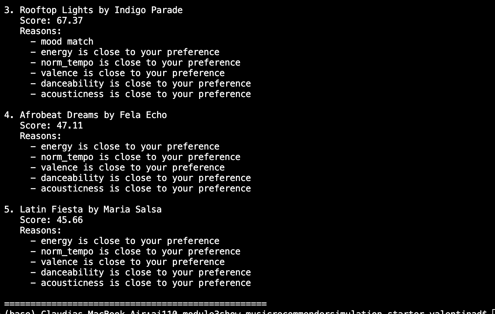
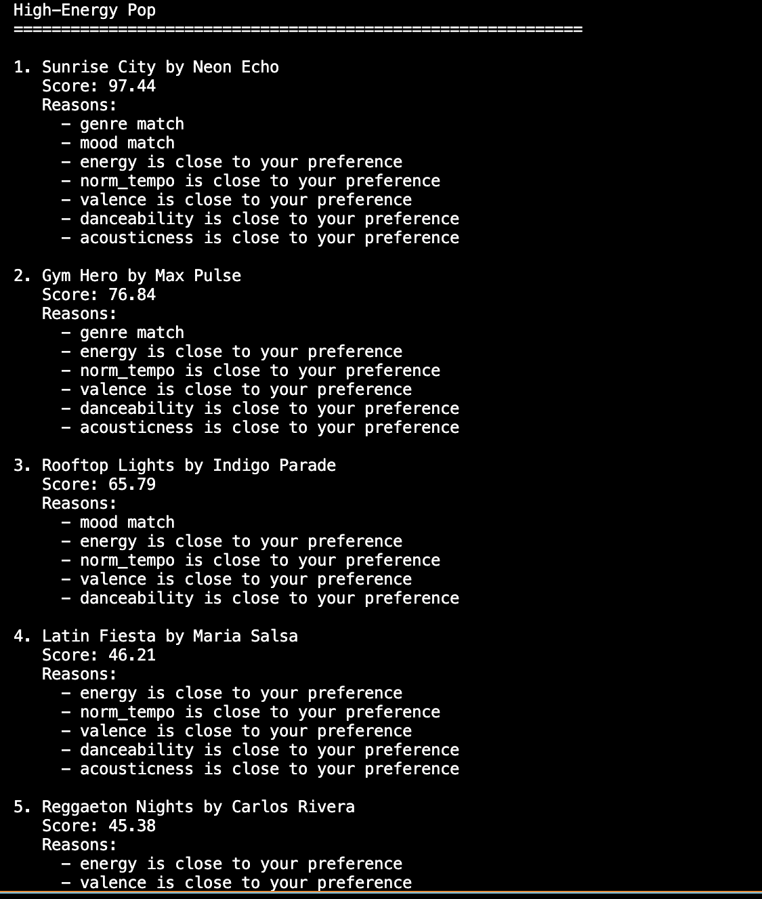
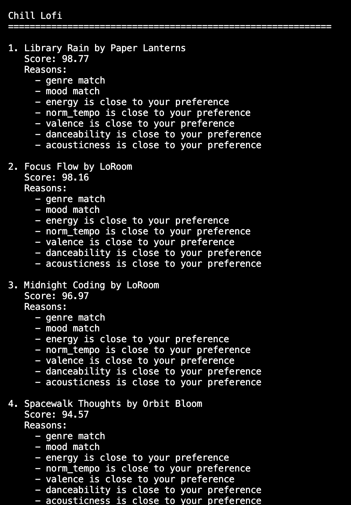
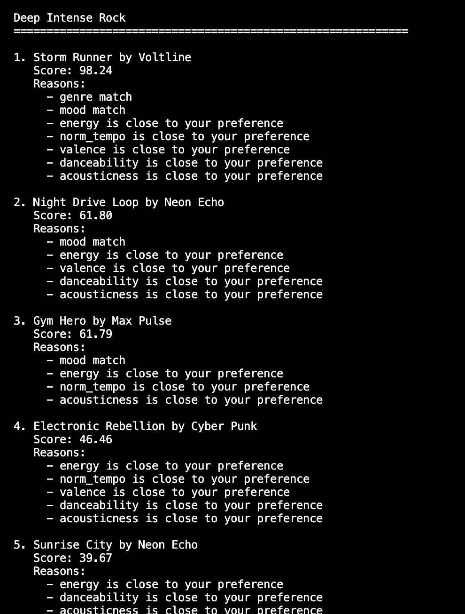
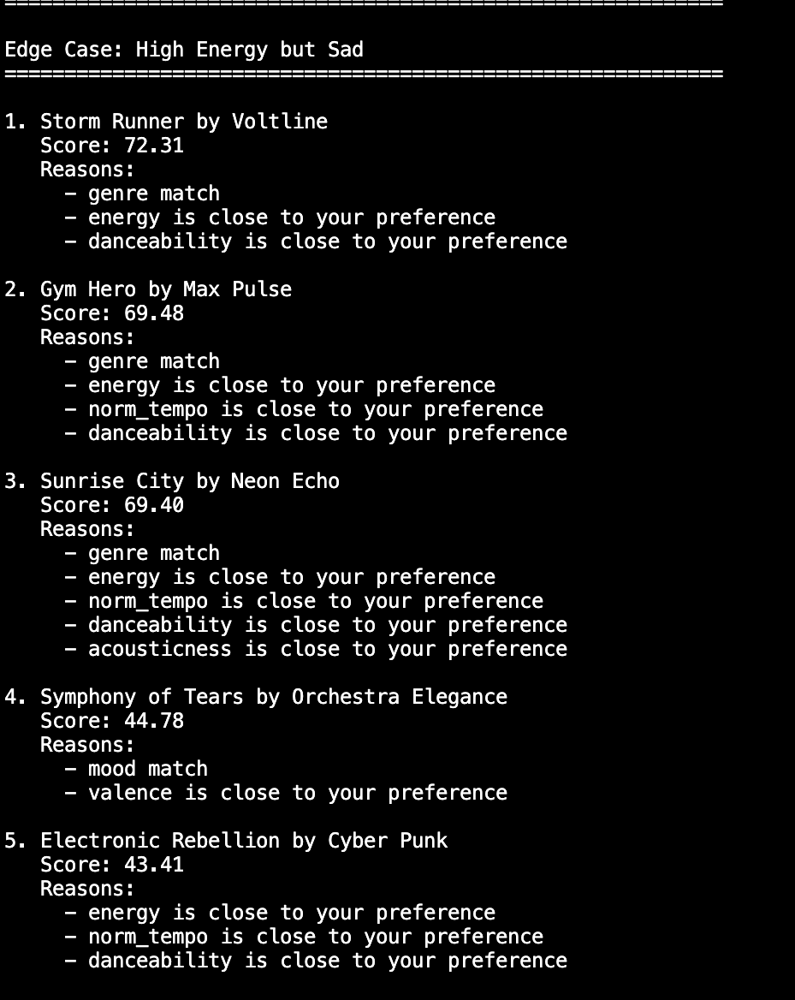

Music Recommender Simulation
Project Summary

This project builds a simple music recommender system that suggests songs based on a user’s preferences. It uses song features like genre, mood, and audio characteristics to calculate how well each song matches the user. The system then ranks songs and returns the top recommendations. This project demonstrates how basic rules and data can be used to simulate real-world recommendation systems.

How The System Works
Algorithm Recipe

Each song starts with a score of 0. The system then assigns points based on how well the song matches the user’s preferences:

+2.0 points if the song’s genre matches the user’s preferred genres
+1.0 point if the song’s mood matches the user’s preferred moods

The system also adds similarity points based on how close the song’s numeric features are to the user’s target values:

Energy: up to +1.5 points
Tempo (BPM): up to +1.0 point
Valence: up to +1.0 point
Danceability: up to +1.0 point
Acousticness: up to +0.5 point

The closer the song’s values are to the user’s targets, the more points it receives.

After scoring all songs, the system sorts them from highest to lowest score and recommends the top matches.

Potential Biases

This system may over-prioritize genre because it has the highest weight in the scoring system. As a result, it might ignore songs from different genres that still match the user’s mood or overall vibe.

Additionally, the system uses fixed weights for all users, which means it assumes everyone values features like genre and energy the same way. This could limit personalization and reduce recommendation diversity.

Experiments You Tried

I experimented with adjusting the weights of different features in the scoring function. For example, I reduced the importance of genre and increased the importance of energy. After making this change, I noticed that songs with similar energy levels were ranked higher, even if they did not match the genre as closely. This showed that the system is very sensitive to weight changes.

I also tested removing certain features, such as mood, and observed that the recommendations became less accurate and less aligned with user expectations. This confirmed that mood plays an important role in making recommendations feel more natural.

Limitations and Risks

This recommender has several limitations. It only works on a small dataset of songs, which reduces variety and can cause the same songs to appear frequently. It does not consider lyrics, artist similarity, or user listening history, which are important in real systems. Additionally, the scoring system may over-favor certain features like genre or energy, leading to less diverse recommendations.

Reflection

This project helped me understand how recommender systems turn data into predictions using simple rules. I learned that even basic scoring methods can produce results that feel personalized. However, I also saw how bias can appear when certain features or data are overrepresented.

It also showed me that real-world systems are likely much more complex, using large datasets and more advanced models to improve accuracy and diversity. This project made me more aware of how recommendations are generated and how they can influence user choices.

## System Flow Diagram

This diagram shows how user preferences are processed and ranked into recommendations.

## CLI Verification

Here is a screenshot of the terminal output showing the top recommendations:

## Stress Test with Diverse Profiles

### High-Energy Pop

### Chill Lofi

### Deep Intense Rock

### Edge Case: High Energy but Sad
